# DOCUMENTACIÓN DE PROYECTOS Y PULL REQUESTS DE GITHUB 

## 1. Creación de repositorio local

Para crear un repositorio de git y subirlo posteriormente a GitHub en Visual Studio, tendrás que ir a la parte superior izquierda y, en el apartado git, abrir el desplegable y seleccionar la opción "Create git repository".

Una vez dentro de ese apartado, tendrás que rellenar diferentes secciones y dar al botón Create and Push.
- Ruta local del repositorio.
- La cuenta de GitHub a la cual se le subirá el repositorio.
- Nombre del repositorio.

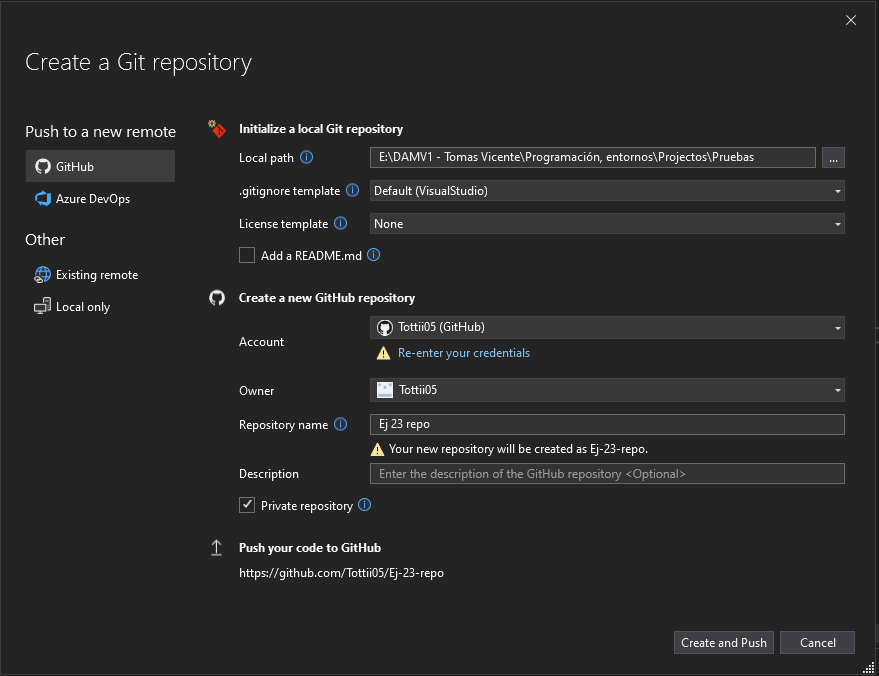

## 2. Creación de proyecto en GitHub 

Una vez creado el repositorio local de git y subido de forma remota a github crearemos el proyecto el cual estará asociado a este repositorio creado recientemente. Para eso entraremos a nuestra cuenta de github, en el apartado de repositorios y entramos en nuestro repositorio creado desde visual studio.

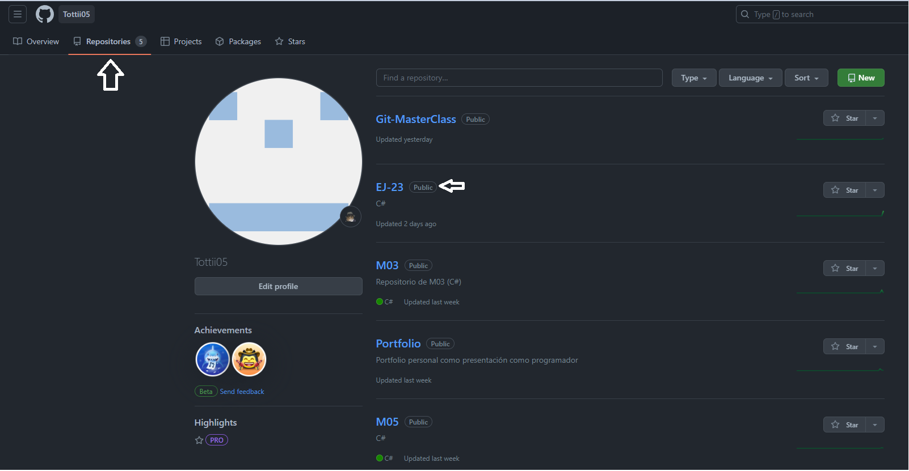

Una vez dentro de nuestro repositorio entramos en el apartado de proyectos para crear el nuestro.

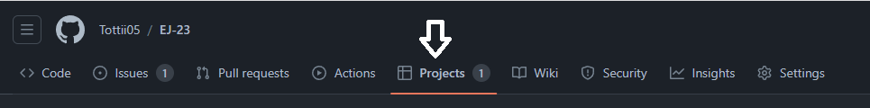

Estando dentro del apartado proyectos dentro de nuestro repositorio, habrá un botón verde en la zona derecha con un texto similar a "Link a project", al cual le daremos clic para abrir el desplegable.

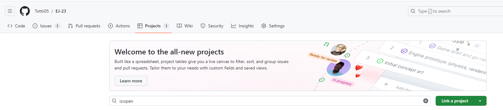

Ahora, abierto el desplegable mostrará todos nuestros proyectos, pero en este caso queremos crear uno vinculado a nuestro repositorio, por lo tanto daremos clic en la última opción del desplegable, donde sale "Create new project...".

Se abrirá un pequeño menú con diferentes plantillas para utilizar en nuestro proyecto, nosotros eligiremos la plantilla "Board" ya que es muy similar a la que se utiliza en la metodología "Scrum".

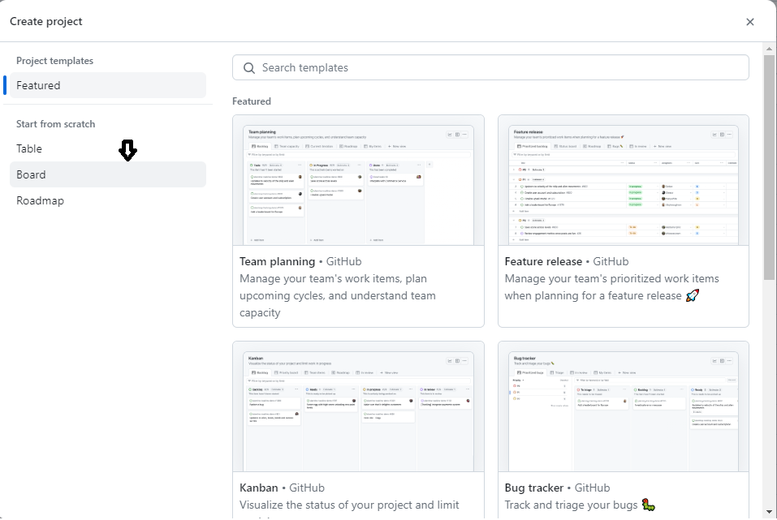

Teniendo la plantilla seleccionada solo queda nombrar a nuestro proyecto, el cual es a gusto del usuario por supuesto.

## 3. Creación de Issues y ramas correspondientes

Ya tenemos el repositorio y el proyecto creados, los dos están vinculados entre sí, ahora toca crear las "Issues" que son las tareas a hacer que tenemos, para eso tendremos que ir a la parte inferior donde el símbolo del + y pondremos el nombre de la tarea.

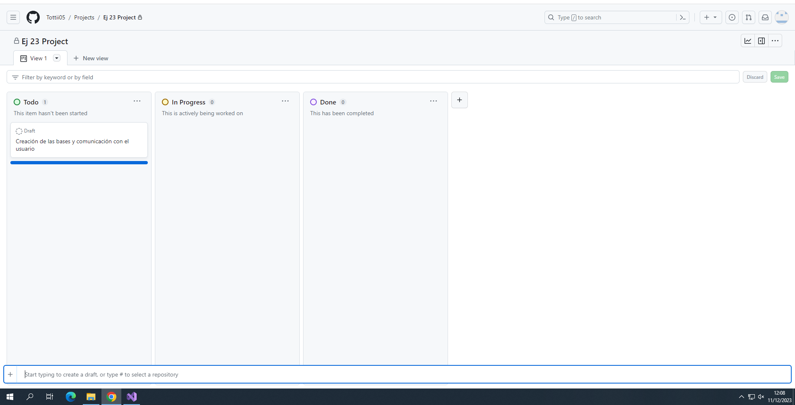

Ahora la tenemos creada pero no está como tarea definitiva a hacer, por lo tanto, tenemos que confirmar nuestra instancia, para ello hay que ir a los 3 puntitos de la tarea creada y dar clic, se abrirá un desplegable el cual hay que seleccionar "Convert to issue".

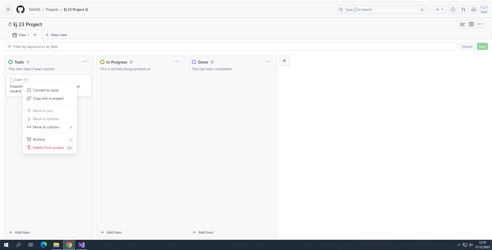

Ahora toca crear las tareas que se crean necesarias e ir poniéndolas en el apartado "In progress", simplemente arrastrando la tarjeta al campo.

Antes de ponernos a programar directamente en Visual Studio, tendremos que crear una rama para cada "Issue" creada en el proyecto, para ello iremos a nuestro repositorio y abriremos el desplegable con el nombre "Main", una vez abierto, en la zona de texto, nombraremos la rama.

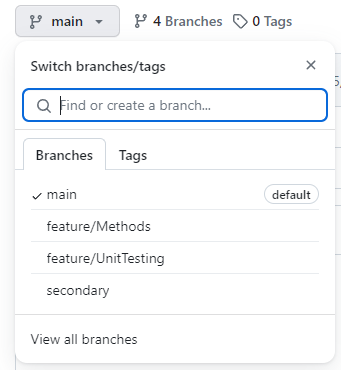

Una vez puesto el nombre, en la zona inferior le daremos al botón "Create branch nombre_rama from main".

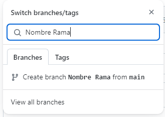

## 4. Creación de pull requests desde Visual Studio

Cuando hayamos terminado alguna tarea que esté en proceso, tendremos que crear una pull request para que se mueva la tarjeta de la tarea a "Done" automáticamente. Para eso tendremos que ir al Visual Studio, en la parte superior izquierda, el apartado git y local repositories y seleccionar nuestro repositorio local.

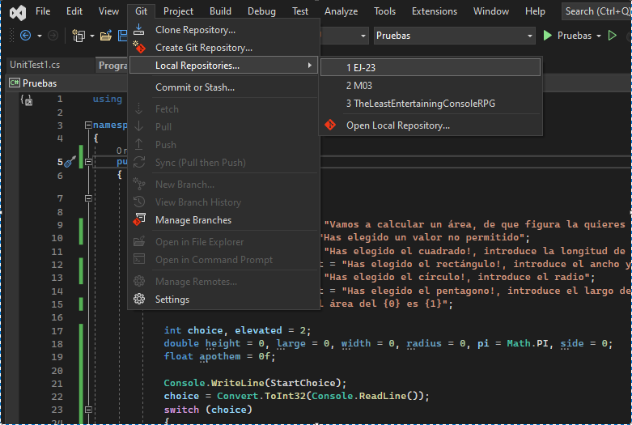

Ahora que tenemos abierto el repositorio local, abriremos la pestaña para crear pull requests, para ello iremos a la parte superior izquierda, apartado view y hacer clic en "Git Changes".

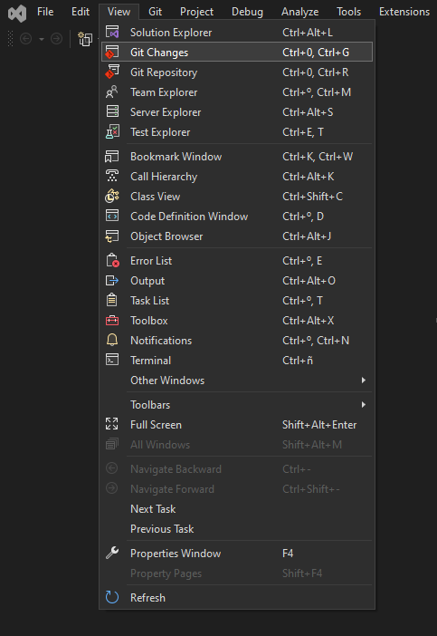

Ahora tendrá que salir una pestaña en la zona derecha, similar a esta:

Ahora que tenemos esta pestaña, hay un desplegable arriba donde se seleccionará la rama correspondiente a la "Issue" creada.

Una vez seleccionada la rama, tendremos que poner obligatoriamente un comentario a la hora de hacer el commit, el comentario puede ser el que uno quiera, pero lo que debe contener al final debe ser "Closes #número de la Issue".

Con el comentario puesto, y una vez dado al botón de "commit all", tendremos que crear una pull request, para ello le damos al botón con un símbolo de una flecha para arriba (pull).

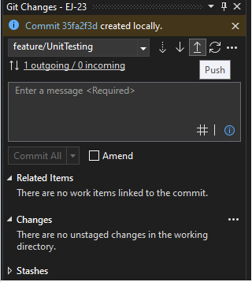

Una vez hecho el push, saldrá un mensajito que pondrá que el push se ha realizado correctamente en la rama seleccionada, para crear la pull request abrá que darle a las letras que salen de color azul que pondrán "Create a Pull Request".

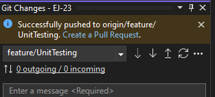

Con la pull request creada habrá que entrar en nuestro proyecto y en el apartado de pull requests.

Dentro de ese apartado saldrá la opción de juntar la rama creada con el proyecto, simplemente tendremos que dar al botón verde que pondrá "Merge pull request".

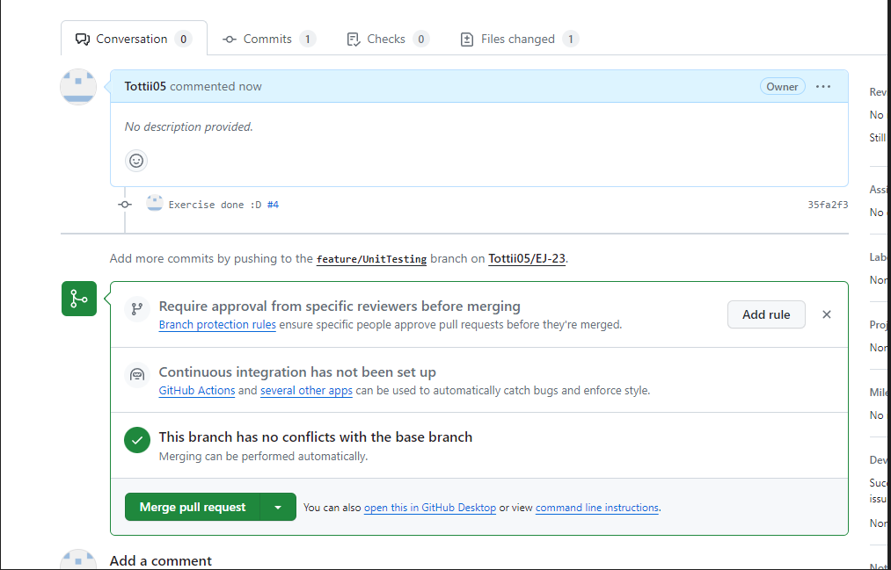

Y con esto hemos terminado!!

Un saludo.
